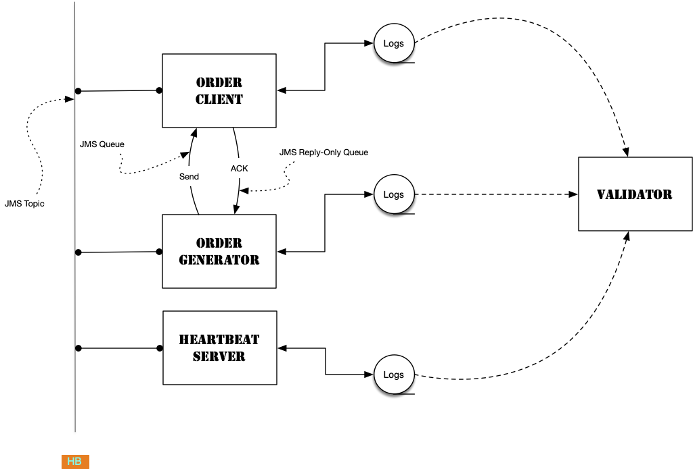

# Overview

## Automated Evidence Collection + Testing

This java based project was built specifically to showcase automated testing & evidence collection. This non-intrusive method does not require extensive rewrites to any projects you have.
It is designed to work with existing projects, and can be adapted to a variety of scenarios.
The framework is designed to be flexible and extensible, allowing you to easily add new tests and validation rules as needed. The goal is to provide a robust and reliable testing framework that can be used to ensure the quality and reliability of your applications.

Evidence collection is a critical aspect of software testing, as it provides a way to verify that the application is functioning as expected. This framework collects evidence in the form of logs that can be used to validate the application's behavior. It then generates a report indicating the disposoition of each test which can be attached to relese notes. 

This is strong enough to satisfy **_regulatory requirements_**, and flexible enough to be used in agile environments. It works in CI/CD pipelines, and can be run locally by developers.


## The Project
Contains the multi-module Maven project configuration, docker-compose, and this is where reports are produced. Additionally, this folder contains the ActiveMQ broker and configuration
allowing you to divorce running that from the tests.


The purpose of the subprojects is to demonstrate a project of *sufficient complexity* to **showcase** the testing framework. Each subproject has a specific role, and they work together to form a complete application. They are *representative* of reality, and should not be considered actual project.



# Tests
Example configuration:

```yaml
tests:
  termination:
    timeout: 15000
  jms-connect:
    - order-generator
    - order-client
    - heartbeat
  log-validation:
    heartbeat:
      - "HEARTBEAT .* Sent heartbeat message.*"
    orders:
      - ".*ORDERS .* Received event: CONSUMER_CREATED for name: heartbeat.*"
      - ".*ORDERS .* Heartbeat sequence.*"
```


The above snippet inddicates:
  *  The tests should terminate after 15 seconds 
  * The tests should validate that the order-generator, order-client, and heartbeat services connected to the broker
  * The tests should validate that the heartbeat service sent a heartbeat message
  
## Explanation
### Termination
This section specifies the conditions under which the tests should be terminated. In this case, a timeout of 15000 milliseconds (15 seconds) is specified. This means that if the tests do not complete within 15 seconds, they will be forcibly terminated. This is useful for preventing tests from running indefinitely in case of unexpected issues.

### JMS Connect
This section specifies the services that need to establish JMS (Java Message Service) connections. In this case, the order-generator, order-client and heartbeat services are specified. This means that the testing framework will validate that these services connected by inspecting management messages from Apache-Artemis. This is not log validation, but completely transparent connection validation.

### Log Validation
This section contains patterns for validating log messages. The framework will inspect the logs of the specified services and look for messages that match the provided regex patterns. If a message matches a pattern, it is considered a successful validation. This allows for a fair amount of flexibility, as the exact content of the log messages may vary, but the overall structure and key information should remain consistent.


# Getting Started
## Clone the repository
```bash
git clone https://github.com/your‑org/automated‑qa‑evidence.git
cd automated‑qa‑evidence
```

## Build the project
```mvn install```

Then, use Docker Compose to build and run all containers. This command builds the images if necessary and starts the order generator, order client, heartbeat monitor and validation engine.

```bash
docker compose up --build
```

## Running JMS
Running JMS is part of the CI/CD aspect, and not part of this project. However, as a
convenience, I have added a sample JMS docker-compose under the ‘devtools’ repository.


## Copyright (c) 2025 DevAltus, LLC

All rights reserved.

Redistribution and use in source and binary forms, with or without modification, are not permitted.

Permission is hereby granted, free of charge, to any person obtaining a copy of this software and associated documentation files (the "Software"), to deal in the Software without restriction,
including without limitation the rights to use, copy, and display the Software, provided that the following conditions are met:

1. The Software is used for personal and non-commercial purposes only.
2. Copies or substantial portions of the Software may not be modified or altered in any way.
3. This notice and the permission notice shall be included in all copies or substantial portions of the Software.

THE SOFTWARE IS PROVIDED "AS IS", WITHOUT WARRANTY OF ANY KIND, EXPRESS OR IMPLIED, INCLUDING BUT NOT LIMITED TO THE WARRANTIES OF MERCHANTABILITY, FITNESS FOR A PARTICULAR PURPOSE AND
NONINFRINGEMENT. IN NO EVENT SHALL THE AUTHORS OR COPYRIGHT HOLDERS BE LIABLE FOR ANY CLAIM, DAMAGES OR OTHER LIABILITY, WHETHER IN AN ACTION OF CONTRACT, TORT OR OTHERWISE, ARISING FROM, OUT OF OR IN
CONNECTION WITH THE SOFTWARE OR THE USE OR OTHER DEALINGS IN THE SOFTWARE.
